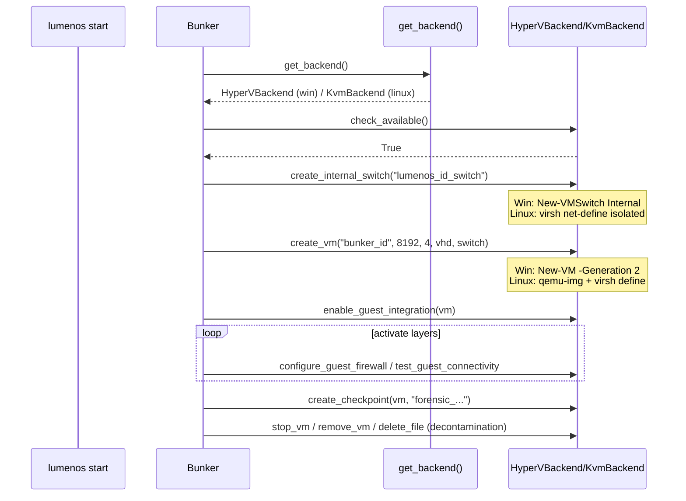

# Design: add-cross-platform-linux-support

## 1. Context
LUMENOS Sandbox acopla dominio a Hyper-V. Objetivo: soportar Linux sin regresión, aplicando Dependency Inversion (Strategy + Factory + Adapter). Strict TDD activo (`py -3 -m pytest tests/ -v`).

## 2. Architecture

### 2.1 Component Diagram
```
┌─────────────────────────────────────────────────────────┐
│                    CLI / API / Bunker                   │
│         (depende de HypervisorBackend ABC)              │
├─────────────────────────────────────────────────────────┤
│  platform.py  ──►  hypervisor/__init__.py (Factory)    │
│  is_windows()      get_backend() → HypervisorBackend   │
├──────────┬──────────┬──────────┬────────────────────────┤
│ HyperV   │  KVM     │  Mock    │ Secrets: Store ABC     │
│ Backend  │ Backend  │ Backend  │ Windows/Linux/File     │
├──────────┴──────────┴──────────┴────────────────────────┤
│  PowerShell (Win) │ libvirt/QEMU (Linux) │ Mock (CI)    │
└─────────────────────────────────────────────────────────┘
```

### 2.2 Decisions
| Decision | Choice | Rationale |
|----------|--------|-----------|
| Pattern | Strategy + Factory + Adapter | Desacopla dominio de hipervisor; OCP: añadir backend sin tocar Bunker |
| Ubicación | `lumenos_sandbox/hypervisor/` | Cohesión; evita `if` disperso; grep `hyperv_client` muestra 23 usos centralizables |
| Compat | Shims `hypervisor.py`/`hyperv_client.py` | Preserva imports existentes; 0 breaking |
| KVM iface | `virsh` + `qemu-img` CLI (no libvirt-python obligatorio) | Funciona sin compilar libvirt; `phone_support.py` ya usa `qemu-img create` así |
| Secrets | Store ABC + fallback Fernet file | `keyring` opcional en Linux; file 0600 garantiza portabilidad |
| Sysmon path | `Path` + `resolve_sysmon_path()` | Evita `C:\\` hardcode en tests portables |

## 3. Module Design

### 3.1 hypervisor/base.py
```python
@dataclass(frozen=True)
class BackendResult: # alias PSResult for compat
    success: bool; stdout: str; stderr: str

class HypervisorBackend(ABC):
    @abstractmethod def check_available(self) -> bool: ...
    @abstractmethod def get_vm_status(self, vm_name: str) -> Optional[str]: ...
    # ... 20 more (ver REQ-01)
```
- Todos retornan safe defaults (False/None/[]) y loguean WARNING — igual que hoy.
- `_run_ps` vive solo en HyperVBackend; KvmBackend usa `_run_virsh`/`_run_qemu_img`.

### 3.2 hypervisor/hyperv_backend.py
- Mueve `hyperv_client.HyperVClient` actual verbatim (incluye `_run_ps`, `PSResult`, singleton logic).
- Sin cambios de semántica; solo nombre clase `HyperVBackend(HypervisorBackend)`.
- Referencia cmdlets: `Get-WindowsOptionalFeature`, `New-VM -Generation 2`, `Checkpoint-VM`, `New-VHD -Differencing`, `New-VMSwitch -SwitchType Internal`, `Invoke-Command -VMName` (VMBus), `Get-CimInstance Win32_*`.

### 3.3 hypervisor/kvm_backend.py
- `check_available()`: `Path("/dev/kvm").exists()` OR `shutil.which("virsh")` AND `virsh --version` rc0.
- `create_vm()`: `qemu-img create -f qcow2 {vhd_path} 100G` + `virsh define` XML:
  ```xml
  <domain type='kvm'><name>{vm_name}</name><memory unit='KiB'>{memory_mb*1024}</memory>
  <vcpu>{cpu_cores}</vcpu><os><type arch='x86_64'>hvm</type></os>
  <devices><disk type='file'><source file='{vhd_path}'/><target dev='vda'/></disk>
  <interface type='network'><source network='{switch_name}'/></interface></devices></domain>
  ```
- `execute_in_guest()`: `virsh qemu-agent-command {vm} '{"execute":"guest-exec","arguments":{"path":"/bin/sh","arg":["-c", cmd]}}'` → `guest-exec-status`; fallback retorna `BackendResult(False, "", "guest agent unavailable")`.
- `create_differencing_disk()`: `qemu-img create -f qcow2 -b {base} {diff}`.
- `create_internal_switch()`: `virsh net-define` isolated + `virsh net-start` (sin `<forward mode='nat'>`).
- `delete_file()`: `Path(path).unlink(missing_ok=True)` (no PowerShell `Remove-Item`).
- Guest ops no Windows (`check_guest_registry`, `check_guest_vbs_status`) retornan `[]`/`{"vbs_enabled": False, "kvm": True}` sin error.

### 3.4 hypervisor/mock_backend.py
- Cada método retorna `False`/`None`/`[]` + `logger.debug("MockBackend.%s called", method)`. Usado en CI y `LUMENOS_HYPERVISOR=mock`.

### 3.5 hypervisor/__init__.py (Factory)
```python
_backend: Optional[HypervisorBackend] = None
def get_backend() -> HypervisorBackend:
    global _backend
    if _backend is not None: return _backend
    env = os.getenv("LUMENOS_HYPERVISOR", "").lower()
    if env == "mock": _backend = MockBackend()
    elif env == "hyperv": _backend = HyperVBackend()
    elif env == "kvm": _backend = KvmBackend()
    elif sys.platform == "win32": _backend = HyperVBackend()
    elif Path("/dev/kvm").exists() or shutil.which("virsh"): _backend = KvmBackend()
    else: _backend = MockBackend()
    return _backend
def set_backend(b: HypervisorBackend): global _backend; _backend = b  # test injection
```
- Lazy, cachea singleton, testeable.

### 3.6 platform.py
```python
def is_windows(): return sys.platform == "win32"
def is_linux(): return sys.platform.startswith("linux")
def has_kvm(): return Path("/dev/kvm").exists()
def has_libvirt(): return shutil.which("virsh") is not None
class HypervisorType(Enum): HYPERV="hyperv"; KVM="kvm"; MOCK="mock"
def detect_hypervisor() -> HypervisorType: ...
```

### 3.7 secrets/store.py
```python
class SecretStore(ABC): @abstractmethod def set(...); @abstractmethod def get(...); @abstractmethod def delete(...)
class WindowsStore(SecretStore): # keyring
class LinuxStore(SecretStore): # try keyring SecretService else Fernet file ~/.config/lumenos/secrets.fernet (0600)
```
- `SecretManager` recibe `store: SecretStore = _detect_store()` (factory por plataforma).
- File fallback cifra con `Fernet(_b64url_encode(bytes.fromhex(key)))` igual que antes.

### 3.8 bunker.py / layers.py injection
- `Bunker.__init__(self, config, backend: Optional[HypervisorBackend]=None)`: `self.backend = backend or get_backend()`.
- `_verify_system_requirements()`: `if not self.backend.check_available(): raise SystemError(...)` (antes `check_hyper_v_available()`).
- `_load_base_image()` / `_allocate_resources()` usan `self.backend.create_internal_switch/create_vm` (no import directo).
- `SecurityLayerBase.__init__` recibe `backend` opcional; `verify()` delega a backend (sin `from .hyperv_client import ...` inline).
- `DecontaminationRunner` idem.

## 4. Sequence: Bunker Lifecycle Cross-Platform


## 5. Data & Artifacts
- No schema changes: `lumenos_state.db` guarda `vm_name`/`switch_name` agnósticos (Win `bunker_id`, Linux mismo).
- VHD paths: Windows `.vhdx`, Linux `.qcow2` — extensión decide tool (`qemu-img` infiere formato).
- Logs: `JSONFormatter` ya agnóstico.

## 6. Security Considerations
- Isolated switch sin `<forward>` garantiza air-gap igual que Hyper-V Internal (verificado por `test_guest_connectivity` en ambos).
- `qemu-guest-agent` se usa solo para `guest-exec`; si no disponible, guest ops fallan closed (retornan False) sin exponer host.
- File secrets con 0600 + Fernet evita plaintext en disk; `~/.config/lumenos/` creado con `mkdir(parents=True, mode=0o700)`.
- No se expone `libvirtd` TCP; solo `qemu:///system` local.

## 7. Testing Strategy (Strict TDD)
- Red: tests que mockean `get_backend` retornando `MockBackend` verifican selección y que `Bunker` no importa `hyperv_client` directo.
- Green: implementar backends + factory + shims.
- Triangulate: tests paramétricos `HyperVBackend` vs `KvmBackend` vs `MockBackend` para cada método del contrato.
- Tests existentes (`tests/test_*`) siguen pasando con `LUMENOS_HYPERVISOR=mock` (conftest patcha `hypervisor.get_backend`).
- Nuevos tests: `tests/test_hypervisor_backends.py`, `tests/test_platform.py`, `tests/test_secrets_store.py`.

## 8. File Impact
- Nuevos: `hypervisor/__init__.py`, `base.py`, `hyperv_backend.py`, `kvm_backend.py`, `mock_backend.py`, `platform.py`, `secrets/store.py`, `scripts/check_env.sh`, `scripts/run_tests.sh`
- Modificados: `hypervisor.py` (shim), `hyperv_client.py` (shim), `bunker.py`, `decontamination.py`, `monitoring.py`, `layers.py`, `types.py`, `secrets.py`, `cli.py`, `pyproject.toml`
- No tocados: `forensics.py`, `compliance.py`, `state.py`, `observability.py` (ya portables)

## 9. Rollback
- Cada backend es archivo aislado; `git revert` del commit KVM no afecta HyperVBackend.
- Shims permiten revertir a `import subprocess` directo sin cambiar callers.

## 10. Open Questions
- ¿Guest Linux o Windows en KVM? Esta entrega soporta guest Windows con qemu-guest-agent Windows (mismo Sysmon path resuelto por `resolve_sysmon_path`). Guest Linux como segundo paso.
